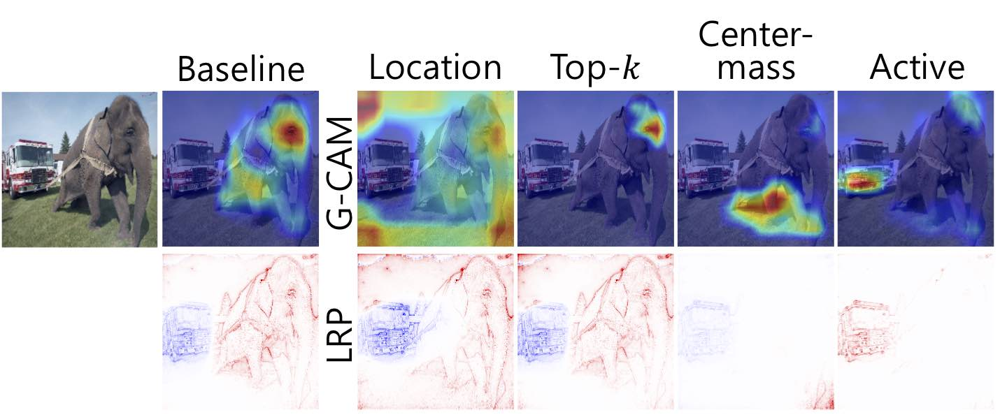

# Fooling Neural Network Interpretations via Adversarial Model Manipulation (NeurIPS 2019)

<p align="center"></p>

--------------------------------------------------------------------------------
This repository provides a PyTorch implementation of "Fooling Neural Network Interpretations via Adversarial Model Manipulation" [Paper](https://arxiv.org/abs/1902.02041).


## Materials

* [Paper](https://arxiv.org/abs/1902.02041)
* [PPT](Materials/PPT.pdf)
* [3-min Video](Materials/Video.md)
* [Poster](Materials/Poster.pdf)

## Dependencies

* Python 3.5+
* PyTorch 0.4.1

## Available

* Dataset: ImageNet
* Model: VGG, ResNet, DenseNet
* Interpretation methods: LRP[1], Grad-CAM[2], Simple Gradient[3], Integrated Gradient [4], Smoooth Gradient [5]
* Foolings: Location, Top-$k$, Center-mass, Active Fooling


## Usage

### 1. Preparing ImageNet ILSVRC 2012 Dataset.
If you do not have the ImageNet dataset, execute the followings sequentially in your terminal. Before downloading, make sure that your system has more than 150GB. If you already have the ImageNet dataset in your system, go to 1.4.
#### 1.1. Downloading
```
mkdir ~/Data
cd Data
wget http://www.image-net.org/challenges/LSVRC/2012/nnoupb/ILSVRC2012_img_train.tar # Currently this code does not work, because the ImageNet server is under maintenance. (29 Oct, 2019)
wget http://www.image-net.org/challenges/LSVRC/2012/nnoupb/ILSVRC2012_img_val.tar # same as above
mkdir image
mv ILSVRC2012_img_train.tar image
mv ILSVRC2012_img_val.tar image
cd image
```
#### 1.2. Unzip train dataset 
```
mkdir train
mv ILSVRC2012_img_train.tar train
cd train
tar xf ILSVRC2012_img_train.tar
find . -name "*.tar" | while read NAME ; do mkdir -p "${NAME%.tar}"; tar -xvf "${NAME}" -C "${NAME%.tar}"; rm -f "${NAME}"; done
```
#### 1.3. Unzip validation dataset 
```
cd ..
mkdir val
mv ILSVRC2012_img_train.val val
cd val
tar xf ILSVRC2012_img_val.tar
```
#### 1.4. Changing the path of dataloader
In `module/dataloader.py`, change the `train_dir` and `val_dir` path to be your ImageNet directory.
```
def dataloader(args, train=False, val=False, test=False):
    if train+val+test != 1:
        print('Only one of the loader should be True')
        print(ERROR)
        
    # Change it to your ImageNet directory
    train_dir = './../../../Interpretable/Data/ImageNet/Data/train'
    val_dir = './../../../Interpretable/Data/ImageNet/Data/val'
```


### 2. Fooling pretrained models
#### 2.1. Demo
This shell script has higher FSR and faster run time than the result in our paper, but accuracy drops more. 
```
cd run_lrp
bash passive_fooling_demo.sh
```
The following scripts contain hyperparameters we have used so far.
```
cd run_lrp
bash passive_fooling.sh
bash active_fooling.sh
```


## Reference

[1] Bach, Sebastian, et al. "On pixel-wise explanations for non-linear classifier decisions by layer-wise relevance propagation." PloS one 10.7 (2015): e0130140.

[2] Selvaraju, Ramprasaath R., et al. "Grad-cam: Visual explanations from deep networks via gradient-based localization." Proceedings of the IEEE International Conference on Computer Vision. 2017.

[3] Simonyan, Karen, Andrea Vedaldi, and Andrew Zisserman. "Deep inside convolutional networks: Visualising image classification models and saliency maps." arXiv preprint arXiv:1312.6034 (2013).

[4] Sundararajan, Mukund, Ankur Taly, and Qiqi Yan. "Axiomatic attribution for deep networks." Proceedings of the 34th International Conference on Machine Learning-Volume 70. JMLR. org, 2017.

[5] Smilkov, Daniel, et al. "Smoothgrad: removing noise by adding noise." arXiv preprint arXiv:1706.03825 (2017).

## Referenced codes
* Modules: Our modules, such as Conv, ReLU, ..., are based on `pytorch.nn`.
* Models: Our models are based on [torchvision](https://pytorch.org/docs/stable/torchvision/index.html)
* Interpretation
    * LRP: We have referenced [lrp_toolbox](https://github.com/sebastian-lapuschkin/lrp_toolbox) and [innvestigate](https://github.com/albermax/innvestigate) for LRP implementation.
